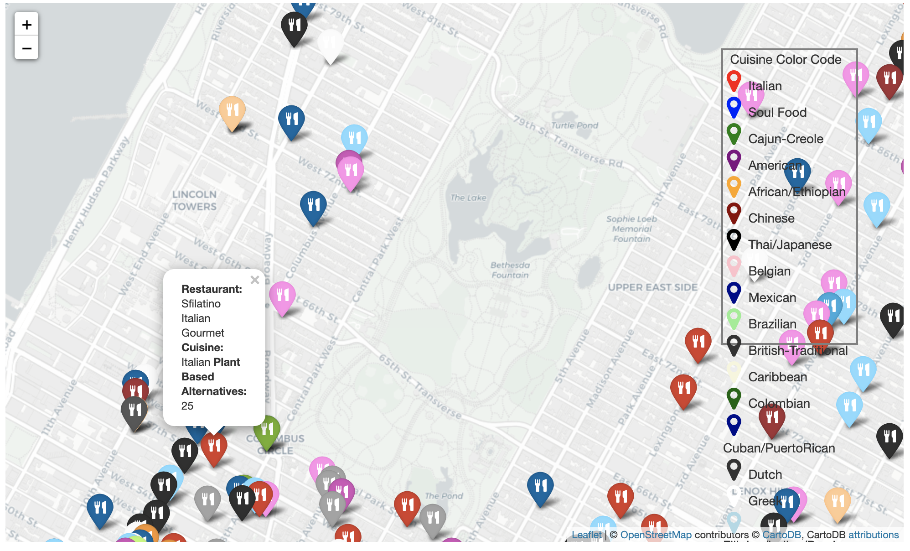
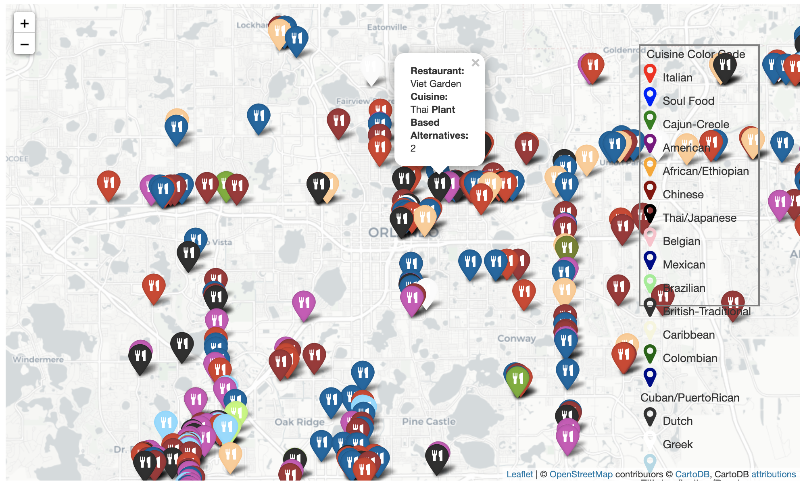
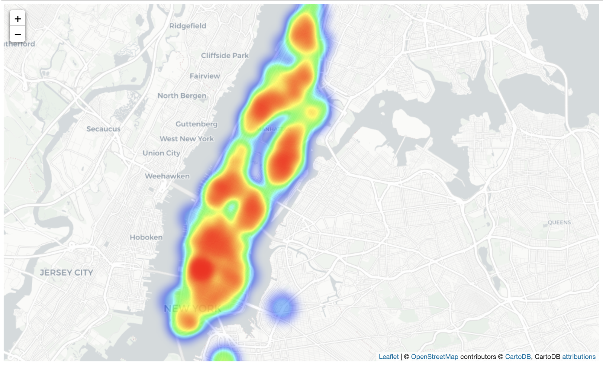
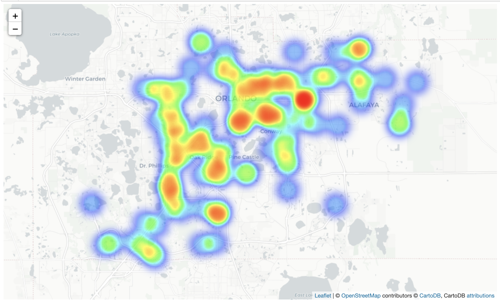

# Representation of Plant-Based Diets Within Different Cultural Cuisines

## Kaylah Thomas | MACS 40400 | March 2021

# Introduction and Peircian Semiotics
Why are some cultural cuisines more accommodating to dietary restrictions than others? My research question aims to map the accessibility of plant-based/alternative diets within different cultures in the US. Many races and ethnicities have brought rich culture and cuisine to the US that stays true to the country from which it originated. With the growing popularity of alternative diets like veganism and vegetarianism, some cultures are naturally adept at providing accommodations for these restrictions, while other cultures do not have as accessible or common accommodations for those with alternative diets. The goal of this research question is to assess the availability of dishes that meet alternative diet requirements across different cultures, and then to examine why there may be more accommodation from some cultures rather than others. Many cultural factors may contribute to the explanations as to why some cuisines provide more alternative options than others including, religious restrictions, food or crop availability, and overall cultural preferences. The data collected for the purposes of this research is originated from US cities, so American culture is also incorporated into these patterns. Due to the rising popularity of plant-based diets in the United States, restaurants may be motivated to provide plant-based items for patrons while still adhering to the cultural patterns of their respective cuisine. Whether these accommodations come naturally or are provided in order to appeal to a new audience, the extent to which these options are available will be assessed through the number of plant-based, vegan, or vegetarian items listed or described on the menu.

*Further introduction of cultural factors, methods of data collection, analysis of data, discussion of findings, ultimate conclusions, and cited sources can be found within the accompanying [Jupyter Notebook](https://github.com/kthomas14/culturalcuisine/blob/main/Final%20Project-%20MACS40400.ipynb).*

## Accompanying Map Figures (full interactive maps available upon download of /interactive maps/ folder)

**Sample of New York City Area with labelled and color coordinated data points according to cuisine type:**

**Sample of Orlando Area with labelled and color coodrinated data points according to cuisine type:**

**Heat Display of New York City area showing dispersion of options across restaurants:**

**Heat Display of Orlando area showing dispersion of Plant-Based options across restaurants:**

